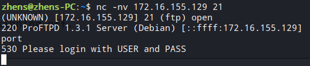
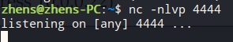
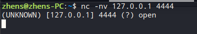
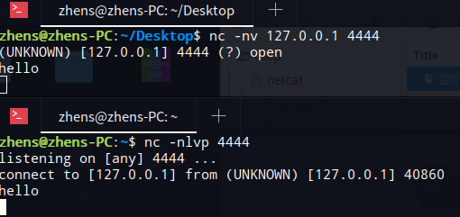
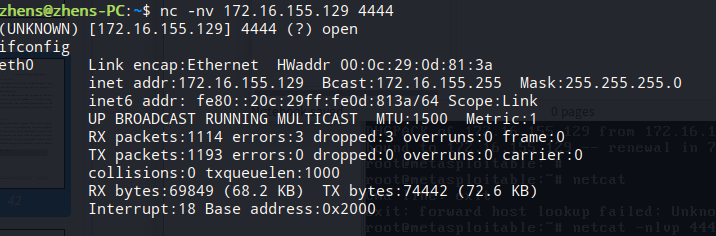
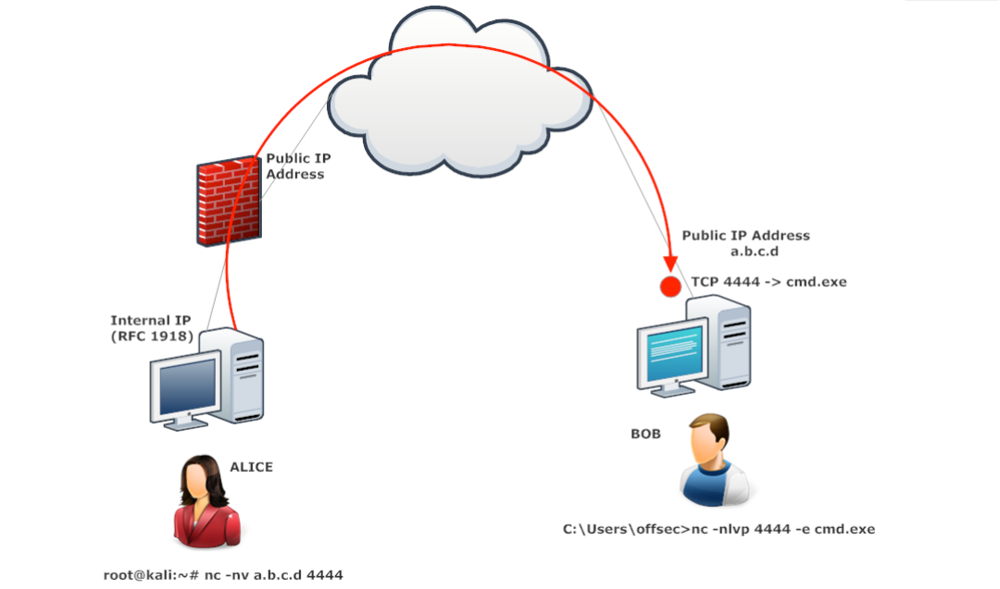
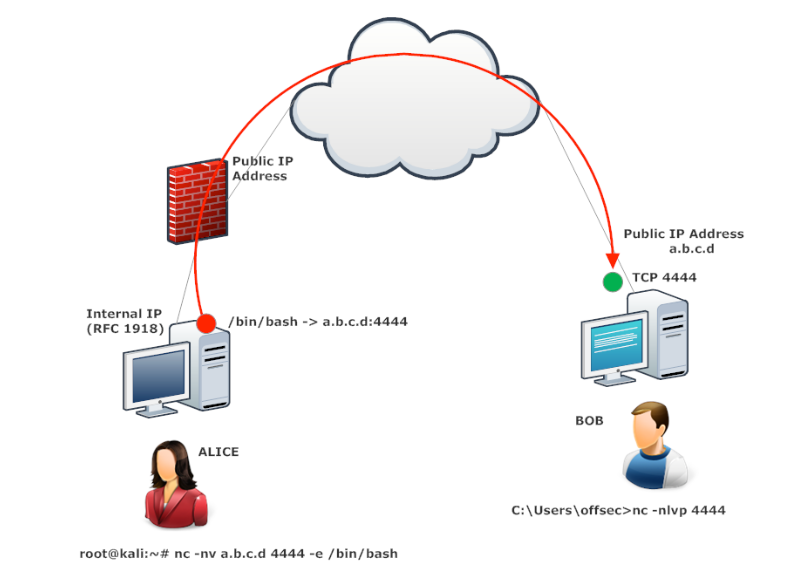

## netcat
---
### 连接端口
连接一个TCP/UDP端口能够得到许多有用的信息
- 检查端口是否开放
- 检查一个端口的banner
- 手动连接网络服务

这个输出告诉我们许多信息
首先tcp连接到172.16.155.129的21端口成功，并且netcat发现了一个打开的远程端口
然后返回来的信息告诉我们，这是一个ftp并且能通过命令进行远程管理
### 监听端口
netcat的一个非常有价值的功能是监听一个TCP/UDP端口
netcat同时可以用来做客户端和服务端来在两台机器之间通过网络通信
在一个终端监听本地4444端口

在另一个终端进行连接

我们能通过这个是两个终端进行通信

### 远程shell
通过netcat可以进行远程管理。Linux将/bin/bash这个程序转到端口即可
-e命令，远程连接后，在/bin/bash里执行

下面两张图说明正向和反向的不同

